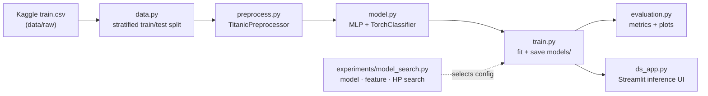
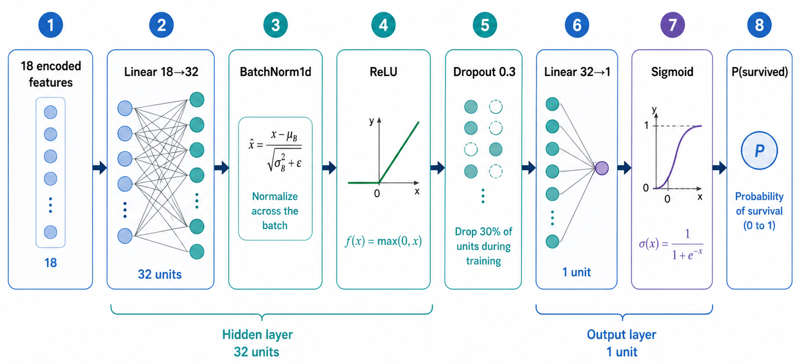

# Titanic Survival — Classification Pipeline

An end-to-end **PyTorch** pipeline that predicts Titanic passenger survival: exploratory
analysis, leakage-safe preprocessing, model/feature/hyperparameter search, a
training script, and a Streamlit inference app.

≈ **81.3% accuracy** and **0.859 ROC-AUC** on a held-out,
labeled test split.

deployed as a Streamlit app: [https://titanic-classification-pipeline.streamlit.app](https://titanic-classification-pipeline.streamlit.app) 

---

## Quick Start Guide

```bash
git clone https://github.com/maya-1807/Titanic_Classification_Pipeline.git
cd Titanic_Classification_Pipeline

python -m venv .venv
source .venv/bin/activate
pip install -r requirements.txt

python train.py
streamlit run ds_app.py
```

In the app, upload:

1. `data/sample_test.csv` or another Titanic-format CSV.
2. `models/model.pt`.
3. `models/preprocessor.joblib`.

---

## Dataset

[**Titanic — Machine Learning from Disaster**](https://www.kaggle.com/competitions/titanic/data)
(Kaggle). 

Contains a labeled `train.csv` (891 passengers) and an *unlabeled*
`test.csv` (targets hidden for leaderboard scoring).

- **Target:** `Survived` — binary (`1` = survived, `0` = died). ~38% positive.
- Because Kaggle's `test.csv` has no labels, we treat `train.csv` as the full labeled dataset
  and **split it ourselves** into train / held-out test so we can report honest held-out
  metrics. Model selection uses cross-validation on the training split.

---

## Overview

This project implements an end-to-end classification pipeline for predicting Titanic passenger
survival. I structured it as a small production-style ML project rather than a single notebook:
EDA, preprocessing, model training, evaluation, and inference are separated into reusable modules.

The main design goal was reproducibility. The data loading code fetches the Titanic dataset from
Kaggle when credentials are available, but the raw labeled CSV is also committed so the project can
run immediately for reviewers. The labeled Kaggle `train.csv` is split deterministically into a
training set and a held-out test set, since Kaggle's official `test.csv` does not contain survival
labels.

I use EDA to identify the strongest signals, engineer specific features, fit all preprocessing
only on training data, and train a compact PyTorch MLP. Model and feature choices are selected with
cross-validation on the training split, while the held-out test split is used only for final evaluation.

The Streamlit app is the inference layer: it lets a user upload a CSV, the trained PyTorch weights,
and the fitted preprocessor, then runs the same preprocessing and evaluation code used by the CLI.



Flow: **fetch → split → preprocess → train → save artifacts → evaluate / serve.** The test
split stays sealed until final evaluation.

---

## Project structure

```
.
├── train.py                 # standalone training script → writes models/
├── ds_app.py                # Streamlit inference + evaluation app
├── requirements.txt
├── src/
│   ├── data.py              # fetch dataset + stratified train/test split
│   ├── preprocess.py        # TitanicPreprocessor: feature engineering, imputation, encoding
│   ├── model.py             # MLP + TorchClassifier
│   └── evaluation.py        # metrics + plots
├── notebooks/
│   └── eda.ipynb            # exploratory data analysis
├── experiments/
│   └── model_search.py      # random-search harness for model/feature/HP selection
├── data/
│   └── raw/train.csv        # committed Kaggle data
└── models/                  # model.pt + preprocessor.joblib (produced by train.py)
```

---

## Setup & installation, Usage

**Requirements:** Python 3.12.

```bash
git clone https://github.com/maya-1807/Titanic_Classification_Pipeline.git
cd Titanic_Classification_Pipeline
python -m venv .venv && source .venv/bin/activate
pip install -r requirements.txt
```

> Fetching the dataset from Kaggle needs an API token, but the
> committed `data/raw/train.csv` means you can run everything without Kaggle setup.

**Quick start:**
For the main assignment flow, run only these two commands:

```bash
# Train the model → writes models/model.pt + models/preprocessor.joblib
python train.py

# Launch the inference app
streamlit run ds_app.py
```

In the Streamlit app, upload:
1. A Titanic-format CSV test dataset, for example `data/sample_test.csv`.
2. The trained PyTorch weights: `models/model.pt`.
3. The fitted preprocessor: `models/preprocessor.joblib`.
`models/model.pt` and `models/preprocessor.joblib` are produced by `python train.py`.

**Optional commands:**
These commands are useful for inspecting or reproducing the supporting parts of the project.
```bash
# Recreate the deterministic train/test CSV files and demo sample
python -m src.data

# Run the preprocessing self-check/report
python -m src.preprocess

# Evaluate the saved model on the held-out test split
python -m src.evaluation

# Run the model/feature/hyperparameter search
python -m experiments.model_search

# Open the exploratory data analysis notebook
jupyter notebook notebooks/eda.ipynb
```

---

## Approach

The Titanic dataset is tiny, noisy, and easy to overfit, so my main priorities were leakage-safe
preprocessing, honest evaluation, and keeping the model simple enough to justify.

### 1. Data and evaluation strategy

Kaggle provides a labeled `train.csv` and an unlabeled `test.csv`. Since the official test set
does not include `Survived`, I used the labeled Kaggle `train.csv` as the full available labeled
dataset and created a deterministic stratified train/test split.

The held-out test split is kept sealed until final evaluation. Model and feature choices are made
only on the training split using cross-validation. This keeps the final reported metrics closer to
a true generalization estimate.

### 2. EDA-driven feature engineering

I used the notebook to understand which signals are real enough to encode:

- `Sex`, `Title`, and `Pclass` capture the strongest “women and children first” pattern.
- `Fare` is heavily right-skewed, so I use `log1p(Fare)`.
- `Cabin` is mostly missing, but the missingness is structural: cabins are much more often recorded
  for first-class passengers. I therefore treat cabin availability/deck as signal rather than simply
  dropping the column.
- Family size has a non-linear relationship with survival: small families do better than passengers
  traveling alone or in large families, so I created `FamilyBin`.
- `Age` has many missing values, but the missingness itself is informative, so I keep an
  `AgeMissing` indicator before imputing.

The preprocessing code turns these findings into deterministic transformations: title extraction,
group-based age imputation, fare imputation by class and port, one-hot encoding for categoricals,
and standard scaling for numeric features.

### 3. Leakage-safe preprocessing

A detail I cared about was avoiding preprocessing leakage. The `TitanicPreprocessor` is fit only on
training data, and during cross-validation it is re-fit inside each fold. This means imputation
statistics, encoders, scalers, and feature choices do not learn from validation or test rows.

The fitted preprocessor is saved together with the PyTorch model, so inference uses exactly the
same transformations as training.

### 4. Model selection

I implemented the final classifier in PyTorch as required, using a compact MLP wrapper `TorchClassifier`.
The wrapper supports `fit`, `predict_proba`, saving/loading, and early stopping.

I also built a small random-search harness over feature sets and MLP hyperparameters. I intentionally
used random search instead of a large exhaustive grid because the dataset has fewer than 900 rows:
very large searches can easily select noise. For the same reason, I used the one-standard-error rule:
choose the simplest model whose cross-validation accuracy is within one standard deviation of the
best model.

This led to a compact one-hidden-layer MLP using the `core` feature set, rather than the largest
model tested. I included logistic regression and random forest only as reference baselines, not as
final candidates, because the assignment specifically asks for a PyTorch classification model.

### 5. Training and inference design

The `train.py` script performs the full training flow: load/fetch data, split, fit the
preprocessor, train the model, and save both artifacts to disk.

The Streamlit app is intentionally artifact-based: the user uploads a CSV, the saved model weights,
and the saved preprocessor. This makes the app closer to a real inference setting, where training
and serving are separate steps. The app reuses `src/evaluation.py`, so CLI evaluation and UI
evaluation share the same metrics and plots.

---
## Selected model
`MLP [32]`, dropout 0.3, batch-norm, ReLU, Adam:



---

## Results

Held-out **test split (134 passengers)**, decision threshold 0.5:

| Metric | Score |
|--------|-------|
| Accuracy | **81.3%** |
| Precision | 82.5% |
| Recall | 64.7% |
| F1 | 0.725 |
| ROC-AUC | 0.859 |

**Confusion matrix** (@ 0.5, positive = *Survived*):

|                     | Predicted Died | Predicted Survived |
|---------------------|:--------------:|:------------------:|
| **Actual Died**     | 76 (TN)        | 7 (FP)             |
| **Actual Survived** | 18 (FN)        | 33 (TP)            |

The model is precise (few false alarms) but somewhat conservative on recall — consistent with
a compact, regularized net on a small dataset.

---
## Dataset fetching & reproducibility

The assignment asks to fetch the Titanic dataset directly from Kaggle. This is implemented in
`src/data.py` via `kagglehub.competition_download("titanic")`.

On first run, `fetch_raw_data()` tries to download Kaggle's Titanic competition data and caches
the labeled `train.csv` at:

```text
data/raw/train.csv
```

Because Kaggle downloads require every reviewer to create an API token, I also committed `data/raw/train.csv` to the repository. This makes the project
reproducible out of the box while still keeping the Kaggle-fetching code in place.

If Kaggle credentials are configured, the dataset can be re-fetched directly from Kaggle. If not,
the pipeline uses the committed cached CSV.

Kaggle's official `test.csv` does not include labels, so evaluation metrics are computed by making
a deterministic stratified split from Kaggle's labeled `train.csv` using `random_state=42`.

---
## Future Improvements

- **Age prediction instead of median imputation** — replace the current group-median age
  imputation with a small supervised age model trained on passengers with known ages. This could
  use features such as `Title`, `Sex`, `Pclass`, `SibSp`, `Parch`, `Fare`, and family/ticket
  information to estimate missing ages more precisely.
- **Family/group-survival features** — passengers in the
  same family/ticket group tend to share an outcome. i'd add a leakage-safe group-survival encoding.
- **Probability calibration & threshold tuning** — optimize the decision threshold for F1/recall rather than fixing 0.5.
- **Richer search** — Bayesian/Hyperband hyperparameter search and light ensembling, with
  repeated/nested CV for a more stable selection estimate.
- **App polish** — add richer validation messages and optional export formats for app results.
